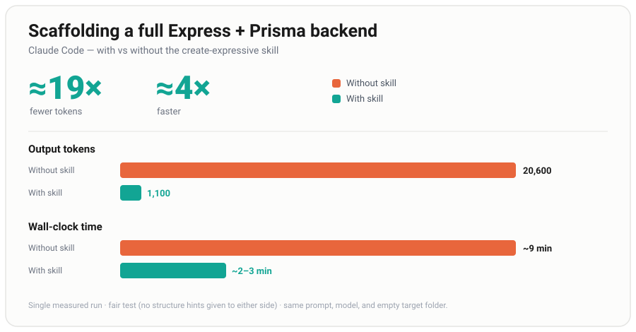

# create-expressive skill

A Claude skill that pairs with the [`create-expressive`](https://www.npmjs.com/package/create-expressive)
npm generator ([source](https://github.com/pratham-srivastava-07/backend-sdk)).

Load this skill and Claude will:

1. **Bootstrap** new Express 5 + Prisma + Zod + TypeScript backends by running the
   generator — not by hand-writing boilerplate (saves output tokens).
2. **Extend** those projects by following the exact layered structure the generator
   produces — so you never re-explain "put this in services, that in repositories"
   (saves input tokens, every session).



## Install

Pick whichever matches your setup — the skill works identically either way.

### Option A — skills.sh CLI (works with any agent)

One command, no marketplace setup:

```bash
npx skills add pratham-srivastava-07/create-expressive-skill
```

This pulls the skill straight from this repo and configures it for your agent.

### Option B — Claude Code plugin

From within Claude Code, add the marketplace, install, then reload:

```
/plugin marketplace add pratham-srivastava-07/create-expressive-skill
/plugin install create-expressive@create-expressive
/reload-plugins
```

This repo is a single-skill plugin (its `SKILL.md` lives at the root), so it installs and
auto-loads across all your projects.

### Option C — manual (per-machine)

Copy this folder into your Claude Code skills directory:

```
~/.claude/skills/create-expressive/
```

(Ensure the entry file is named `SKILL.md`.) The skill then auto-loads when you ask to
scaffold or extend an Express backend.

## Why it saves tokens

| Phase | Without the skill | With the skill |
|---|---|---|
| Creating a project | Claude hand-types `package.json`, `tsconfig`, controllers… (thousands of output tokens) | Runs `npx create-expressive` — files land on disk for near-zero tokens |
| Adding features later | You re-explain the architecture each session | Claude already knows the fixed layout and mirrors the `user` slice |

Measured on multiple fair runs (no structure hints given to either side): **~20,600 → ~1,100
output tokens** to scaffold a full backend — about **19× fewer**. See `assets/benchmark.svg`.

## Usage

Once installed, just ask in plain language:

- "Set me up a new Express backend called `orders-api`."

See `examples/` for worked walkthroughs and `docs/` for architecture and stack details.

## The generated stack

TypeScript · Express 5 · Prisma · Zod · JWT + bcrypt · centralized error handling.
Layered: **Routes → Controllers → Services → Repositories → Prisma**.

More stacks (Express + Mongo, Fastify + MySQL/Postgres) are planned — see
`docs/supported-stack.md`.

## License

MIT — see `LICENSE`.
